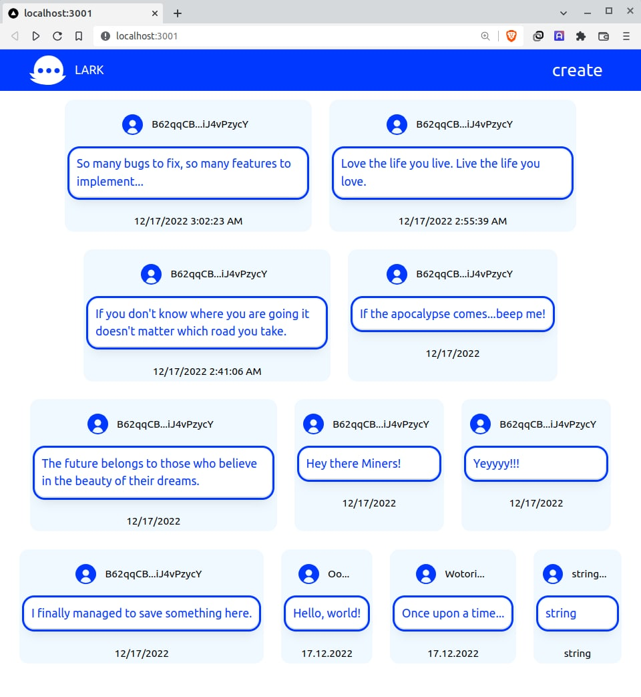

# Lark
Lark is the microblogging platform powered by mina blockchain.

## UI


## Features
### currently done
- interface for fetch and display larks (litle text blogposts)
- inteface for creating larks
- mina smart contract for user validation
- backend api for storing the data
- app status bar (all worker activities discriptions at the bottom of the screen)
### to do
- store data on mina chain
- mint lark blogpost with hashtags
- query larks by hashtags
- filter by hashtags
- add "like button" feature
- authors awards (related to "like" feature) 
- donations
# Description of the contents

## contracts
consist mina default contract Add for tests and education purposes and [nft-zkapp](https://github.com/comdex/nft-zkapp) fork for future use of lark messages creation.

## ui_react
First iter UI was made with react but there is an error while running the worker so I switched to next from official mina tutorial.
```
Uncaught (in promise) DOMException: Failed to execute 'postMessage' on 'Worker': SharedArrayBuffer transfer requires self.crossOriginIsolated.
```

## ui_next
UI based on next js. Currently in production version of dApp. Basic logic with workers and transaction taken from official [mina 4th tutorial](https://docs.minaprotocol.com/zkapps/tutorials/zkapp-ui-with-react).

## backend
Simple server and api for storing and reading larks offchain.
