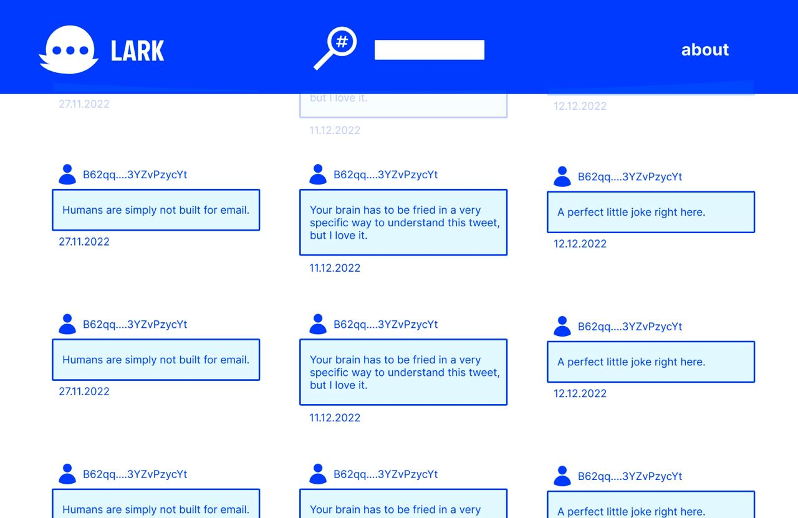

# Lark
Lark is the microblogging platform powered by mina blockchain.
### [meaning](https://www.urbandictionary.com/define.php?term=Lark)
 #1
```
Speedy, real quick like
Also: to do something in a super speedy or swift manor
"Dude, that pizza got here hella lark." or, "Where'd Clarence go? He was just here." "Oh, he larked out, bro."
```
 #2
```
Laugh, a bit of fun, a joke, a jape.
Often mistaken by foolish and ill-educated West-country folk as 'laugh', because they can't understand a bloody word Southerners say.
```

# UI
